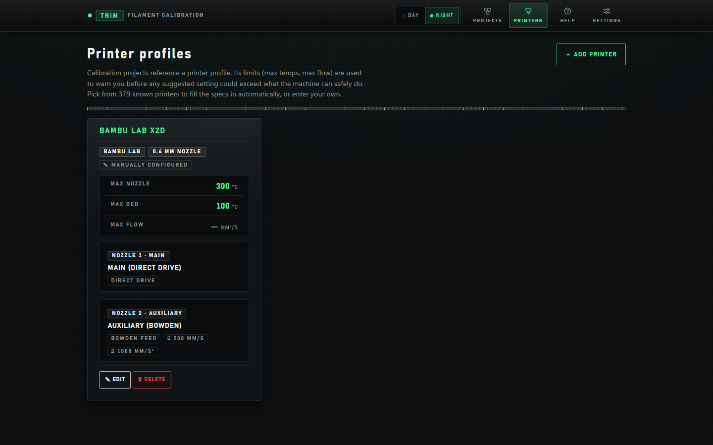
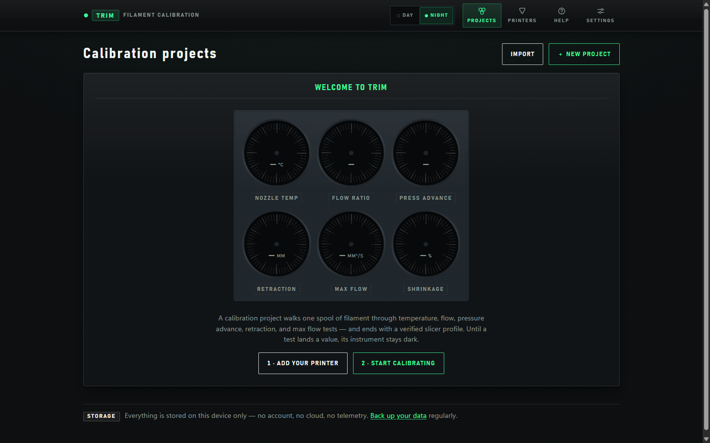
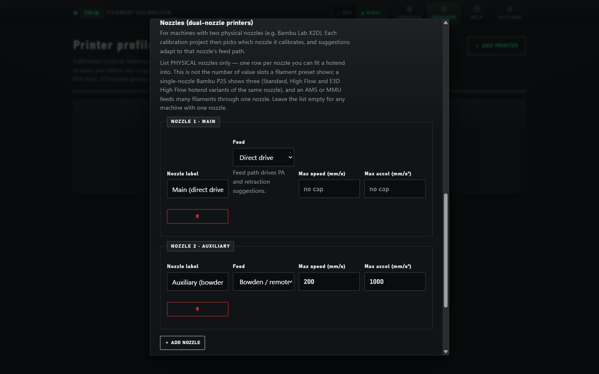
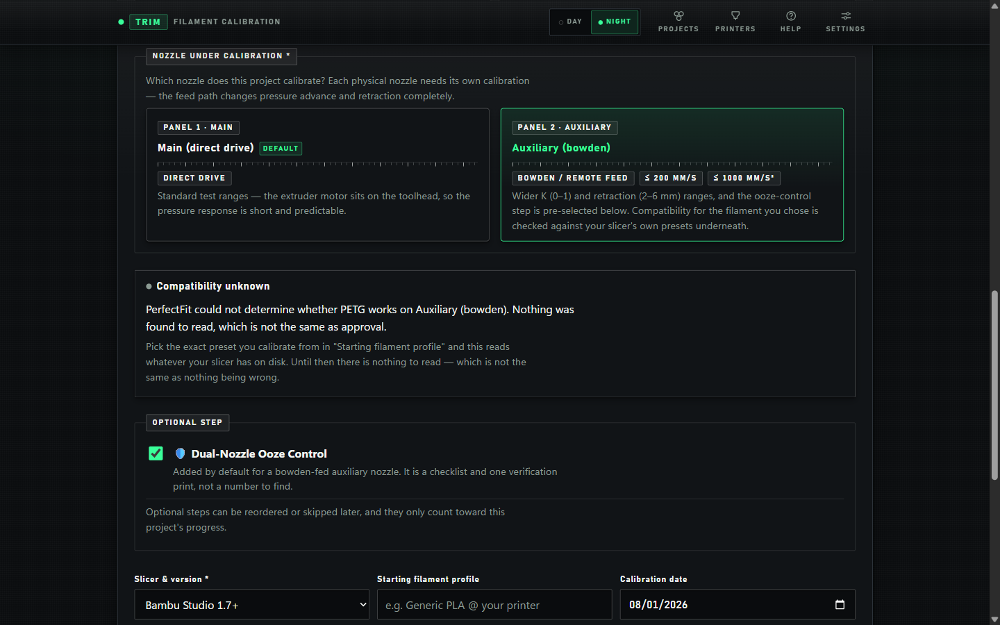
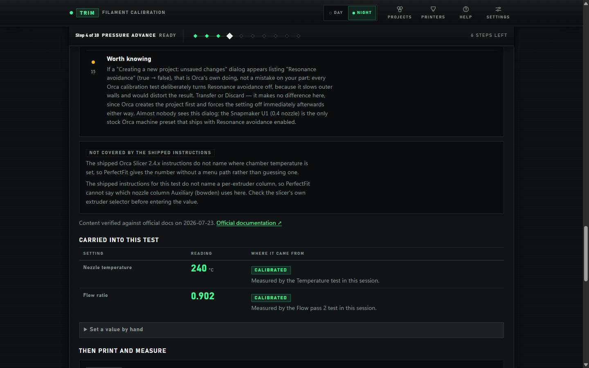
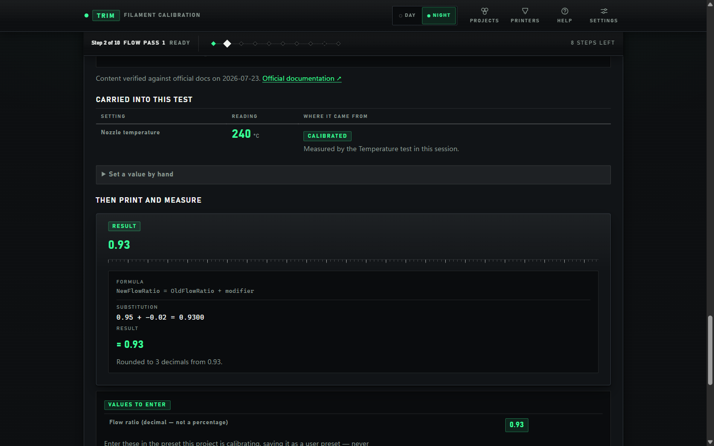
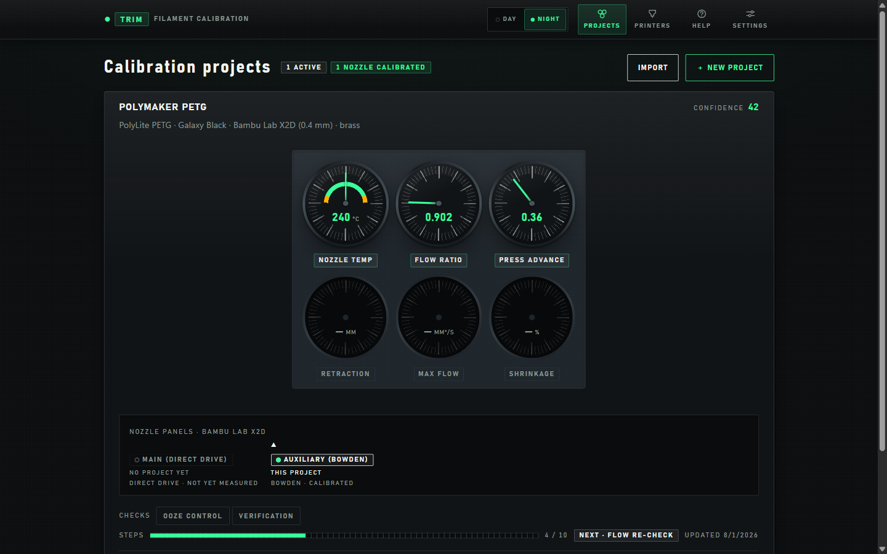
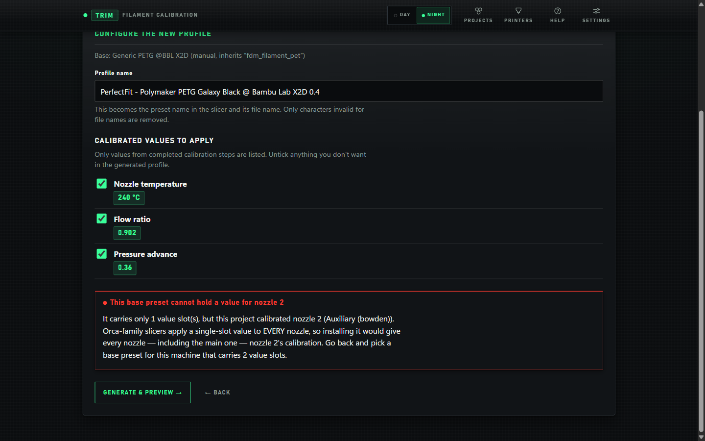
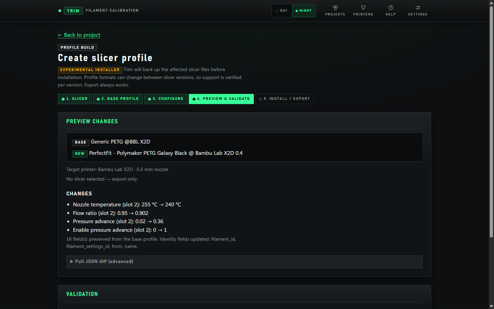
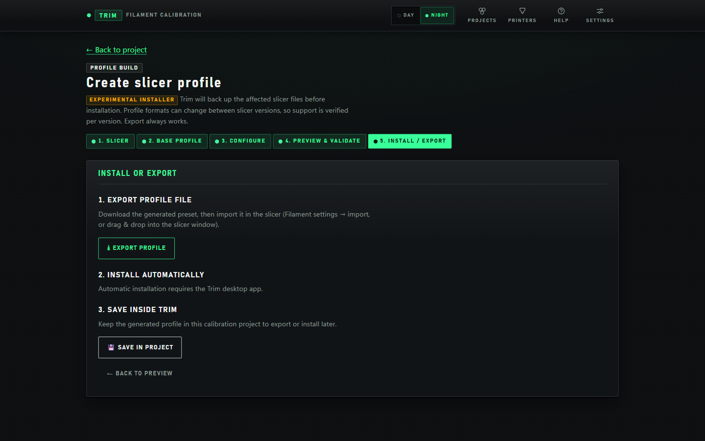

# Trim: Filament Calibration

**The calibration wizard that knows your printer has more than one nozzle.**

Trim walks one spool of filament through the tests that produce a filament preset — temperature,
flow, pressure advance, retraction, max flow, shrinkage — then generates the preset for your
Orca-family slicer and says exactly where every number goes. Unlike every other calibration tool,
including the upstream project this forked from, it models a printer as having one *or more*
nozzles, and each nozzle's feed path decides its ranges: a bowden auxiliary is never handed
direct-drive numbers.

You run the test prints yourself, in your own slicer. Trim never talks to the printer.

It runs as a local-first web app and as a desktop app. No account, no backend, no telemetry.

**[Get it](#get-it) · [Why per-nozzle](#why-this-exists-the-second-nozzle) ·
[Your first calibration](#your-first-calibration) · [Slicer support](#slicer-support) ·
[Limits](#limits)**

**What it asks of you.** Nine calibration tests ship in the default order (ten with the dual-nozzle
ooze step), each one a print you set up and run in your own slicer — a first pass is an afternoon's
work, not five minutes. Trim never drives the slicer and never starts a print. It is built to be
abandoned mid-flow: state is saved as you go, so you can close it while a print runs and come back
days later to the step you left, with every carried-forward value still showing where it came from.
It assumes you can find your way around slicer settings. It does not assume you know which
calibrations exist, what order they run in, or which field each result belongs in.

## Get it

**Desktop app** — **no release has been published yet.** The release workflow is written to build a
Windows `.exe` (NSIS), a macOS universal `.dmg`, and Linux `.deb` and `.AppImage` from a tag, but
the [Releases](https://github.com/espentruls/Trim/releases) page is empty, so today the only way to
get the desktop app is to build it yourself: `npm run tauri build`. The desktop build is the one
that can scan your slicer installation and write a preset into it — **on Windows**. Direct install
is verified and enabled only on Windows today; on macOS and Linux the desktop build scans,
generates, previews and exports, and the wizard points you at manual import. See
[Slicer support](#slicer-support).

**Browser** — the app is a static bundle you can host yourself
([Nginx](docs/DEVELOPMENT.md#hosting-on-nginx), [Docker](docs/DEVELOPMENT.md#docker)) or run
locally. There is no public instance to try — you host it or run it yourself. Everything works
except writing into a slicer: the browser build downloads the generated `.json` preset for manual
import instead.

## The name

Trim is the aviation sense. Trimming an aircraft sets the controls so it holds its attitude
without constant correction: you trim once per configuration. You calibrate once per filament and
nozzle, and the printer then prints correctly without further intervention. Same structure. The app
was called *PerfectFit X2D* up to 2.0.0; the X2D in the name claimed one printer, and it works with
any of them. See [CHANGELOG.md](CHANGELOG.md) for what the 3.0.0 rename means for existing data.

> **This is a fork.** Trim builds on
> [PerfectFit](https://github.com/tayloraaron078-tech/Filament_Calibration_Wizard) by Aaron Taylor
> and adds per-nozzle calibration. It ships under its own product name and bundle
> identifier, so it installs **alongside** upstream rather than over it and keeps a separate data
> store. Every download link, issue link, and install guide in this repository refers to this fork;
> upstream is credited, not linked as a download.

## Why this exists: the second nozzle

**Trim models a printer as having one or more physical nozzles, and each nozzle's feed path
decides its suggested ranges.** On a Bambu Lab X2D the main nozzle is direct drive and gets
automatic Flow Dynamics calibration from the printer; the auxiliary is bowden-fed from a
rear-mounted extruder and gets none. Community reports put its K an order of magnitude above the
main nozzle's — typically 0.5–1.0 against 0–0.1 — and its retraction correspondingly longer;
Bambu's own machine profile ships 2 mm on the auxiliary against 0.8 mm on the main. Those are the
numbers the suggested ranges are built from, and they are community-sourced except the shipped
defaults.

If your auxiliary nozzle strings or oozes, that is the case this exists for. Its stock defaults
ooze, and Bambu Studio has a reported bug —
[BambuStudio #10404](https://github.com/bambulab/BambuStudio/issues/10404) — where a filament preset
whose *Bowden Extruder* retraction override is left unset silently falls back to the main nozzle's
0.8 mm default, far too little for a bowden path. Trim carries that warning into the suggested
ranges, the retraction step and the ooze-control checklist. Reported on Bambu's own tracker, not
documented in the wiki.

A bowden auxiliary is never handed direct-drive numbers here:

- A printer profile carries a list of nozzles, each with its own feed path and optional
  speed/acceleration caps.
- A calibration project targets **one** nozzle. Selecting a bowden auxiliary switches the
  pressure-advance range to 0–1.0 in 0.02 steps and retraction to 2–6 mm in 0.5 mm steps, and
  deliberately ignores the retraction range saved on the printer profile, because that range
  describes the main feed path.
- A guided session holds one independent working profile per nozzle, so a value measured on one
  nozzle never bleeds into the other.
- Nozzle count is read only from the printer profile's own nozzle list — never inferred from how
  many value slots a slicer preset happens to have.



*NOZZLE 1 · MAIN — Main (direct drive). NOZZLE 2 · AUXILIARY — Auxiliary (bowden), with its own caps
of ≤ 200 MM/S and ≤ 1000 MM/S². Machine limits above it: max nozzle 300 °C, max bed 100 °C, max flow
unmeasured (—).*

The X2D is the machine the research is based on, and the only machine whose nozzle layout ships as a
template. The H2D and H2C appear in the printer database as machine specs only — the database has no
per-nozzle field — so their nozzles and feed paths must be entered by hand. **No calibration has
ever been carried through to a print on any machine** — see [Limits](#limits).

## Your first calibration

Launch it and the dashboard opens on a panel of six instrument dials. An unmeasured value is never
rendered as zero — it reads an em-dash and its dial stays dark. That distinction runs through the
whole app: "not measured" and "zero" are different facts.



*Nozzle temp, flow ratio, pressure advance, retraction, max flow and shrinkage, unmeasured. Calls to
action: 1 · ADD YOUR PRINTER, 2 · START CALIBRATING.*

### 1. Add your printer

**PRINTERS → + ADD PRINTER.** Pick from 379 known printers across 64 manufacturers to fill the
specs in automatically, or enter your own. Machine limits (max nozzle and bed temperature, max
flow) are used to warn you before a suggested setting could exceed what the machine can safely do.
Where the database publishes no limit, the form uses a stand-in — 260 °C nozzle, 100 °C bed — and
labels it as **not** a specification.

Nozzles are a repeatable list: one row per physical nozzle you can fit a hotend into, each with its
own **Feed** (direct drive, or bowden/remote) and optional max speed and acceleration. There is a
one-click Bambu Lab X2D quick-fill that builds the two-nozzle layout for you.



*NOZZLE 1 · MAIN — Main (direct drive), Feed "Direct drive", max speed and accel left at "no cap",
help text "Feed path drives PA and retraction suggestions." NOZZLE 2 · AUXILIARY — Auxiliary
(bowden), "Bowden / remote", 200 mm/s, 1000 mm/s². Below them, + ADD NOZZLE.*

### 2. Create a calibration project

**PROJECTS → + NEW PROJECT.** A project is one spool on one nozzle. If the printer has more than
one nozzle the form asks which — **NOZZLE UNDER CALIBRATION** — and the cards state what changes:

- *PANEL 1 · MAIN* — "Standard test ranges — the extruder motor sits on the toolhead, so the
  pressure response is short and predictable."
- *PANEL 2 · AUXILIARY* — "Wider K (0–1) and retraction (2–6 mm) ranges, and the ooze-control step
  is pre-selected below."

Picking the bowden auxiliary ticks the optional **Dual-Nozzle Ooze Control** step, which is a
checklist and one verification print rather than a number to find. It checks levers — prime tower,
travel speed, wipe, z-hop, the #10404 override — that Trim names but does not compute.



*Chips: BOWDEN / REMOTE FEED, ≤ 200 MM/S, ≤ 1000 MM/S². A "Compatibility unknown" panel reads
"PerfectFit could not determine whether PETG works on Auxiliary (bowden). Nothing was found to read,
which is not the same as approval." — one of the rename leftovers noted under [Limits](#limits).*

Where installed slicer preset data can be read, Trim resolves the `inherits` chain and gives a
graded verdict on whether that material suits that nozzle. It is a **warning only** — it never
blocks a calibration, and *unknown* is explicitly not an all-clear. Override a warning and the
verdict is recorded verbatim on the project, so later output cannot read as though the app had
approved the pairing.

### 3. Work the guided session

One screen per test. The session header pins to the top of the window and carries the step number,
the test name, a status, the step-dot track and how many steps are left, so the context does not
scroll away while you read a long instruction page.

Each step opens with what is **CARRIED INTO THIS TEST**: a table of setting, reading, and where it
came from. Every pre-filled number states its provenance — calibrated, user override, carried
forward, printer default, material default, or unset. A material default does not satisfy a step's
required input; it shows as a placeholder and the step still counts as missing it. Change an
upstream value and downstream steps are marked stale with a reason, rather than silently keeping an
obsolete result.

Where the shipped instruction data does not cover something, the step says so under **NOT COVERED
BY THE SHIPPED INSTRUCTIONS** instead of inventing a menu path, and links the official
documentation with the date it was verified.



*Header: "Step 4 of 10 · PRESSURE ADVANCE · READY", the step-dot track, "6 STEPS LEFT". Below it a
"NOT COVERED BY THE SHIPPED INSTRUCTIONS" panel — still saying PerfectFit, see [Limits](#limits) —
and a CARRIED INTO THIS TEST table: nozzle temperature 240 °C and flow ratio 0.902, both badged
CALIBRATED and naming the test that measured them.*

### 4. Read the result, and check the arithmetic

Every calculation returns its inputs, the formula as a string, the substitution, the result and any
warnings. Thirteen formulas ship this way, and rounding is disclosed. A user who distrusts a result
can check it instead of accepting it.



*RESULT 0.93. FORMULA "NewFlowRatio = OldFlowRatio + modifier", SUBSTITUTION "0.95 + −0.02 =
0.9300", RESULT "= 0.93", the note "Rounded to 3 decimals from 0.93.", and VALUES TO ENTER: "Flow
ratio (decimal — not a percentage)" 0.93.*

Back on the dashboard, a project's dials light as values land. The nozzle-panels strip shows which
of the printer's nozzles this project owns and which are still untouched.



*POLYMAKER PETG · PolyLite PETG · Galaxy Black · Bambu Lab X2D (0.4 mm) · brass, CONFIDENCE 42. Lit:
NOZZLE TEMP 240 °C, FLOW RATIO 0.902, PRESS ADVANCE 0.36; dark: RETRACTION, MAX FLOW, SHRINKAGE. A
NOZZLE PANELS · BAMBU LAB X2D strip marks MAIN (DIRECT DRIVE) — NO PROJECT YET and AUXILIARY
(BOWDEN) — THIS PROJECT · BOWDEN · CALIBRATED. Steps 4 / 10, NEXT · FLOW RE-CHECK.*

Two experience levels ship: **Coach** (plain-language callouts, good/bad examples, "I'm not sure"
helpers) and **Expert** (ranges, formulas, destinations). Two working surfaces ship side by side:
the guided session above, and the classic step-by-step wizard, reachable from every step.

## The ten calibration tests

Nine ship in every project's default order:

1. Temperature
2. Flow ratio, pass 1
3. Flow ratio, pass 2
4. Pressure advance
5. **Flow re-check**
6. Retraction
7. Max volumetric speed
8. Shrinkage
9. Final verification

The tenth — **Dual-Nozzle Ooze Control** — lives outside the default order and is spliced in
immediately before final verification for projects that opt into it, which in practice means
bowden-auxiliary projects.

Each test carries its purpose, why it sits in that position, an expanded explanation, dependencies,
prerequisites, per-slicer methods, an evaluation guide, result precision, the slicer destination,
and version notes.

Where the shipped order contradicts vendor guidance, the app says so. It quotes Bambu's own
sentence putting Flow Dynamics before Flow Rate, then explains why flow runs first here — and it
labels the flow re-check as **this project's own step, not sourced practice**, because that is the
step that closes the circular dependency between pressure advance and flow. Absences are explained
too: bed temperature and first layer are stated as not-per-filament jobs, and retraction's late
position is stated rather than left looking like an oversight.

## Generating and installing the slicer preset

Generation is **clone-and-patch**: the base preset is deep-cloned, and only values backed by a
completed calibration step with a final value are patched. Unknown fields, arrays and inheritance
survive, and the count of preserved fields is reported. The keys written are
`nozzle_temperature_initial_layer`, `nozzle_temperature`, `filament_flow_ratio`, `pressure_advance`
(plus `enable_pressure_advance`), `filament_retraction_length`, `filament_retraction_speed`,
`filament_max_volumetric_speed` and `filament_shrink`.

Five stages: **1. SLICER → 2. BASE PROFILE → 3. CONFIGURE → 4. PREVIEW & VALIDATE →
5. INSTALL / EXPORT.** Trim ranks and recommends which stock preset to clone from,
deterministically, with reasons.

**Which value slot the calibration is written to is resolved from the base preset's own
extruder-variant legend, read by name — never from the nozzle index.** If the base cannot address
the calibrated nozzle, the value is withheld and reported with a reason instead of written to a
slot every nozzle reads:



*"This base preset cannot hold a value for nozzle 2 — It carries only 1 value slot(s), but this
project calibrated nozzle 2 (Auxiliary (bowden)). Orca-family slicers apply a single-slot value to
EVERY nozzle, so installing it would give every nozzle — including the main one — nozzle 2's
calibration. Go back and pick a base preset for this machine that carries 2 value slots." The
Profile name field above it reads "PerfectFit - Polymaker PETG Galaxy Black @ Bambu Lab X2D 0.4" —
the rename leftover noted under [Limits](#limits).*

Given a base wide enough, the preview lists every changed field with its old value, its new value
and its slot number, and patches only the calibrated nozzle's slot. Validation runs before install,
and warnings such as withheld fields or printer-limit breaches must be explicitly acknowledged.



*Four changes, each naming slot 2: nozzle temperature 255 → 240 °C, flow ratio 0.95 → 0.902,
pressure advance 0.02 → 0.36, and enable pressure advance 0 → 1. Below them: "16 field(s) preserved
from the base profile. Identity fields updated: filament_id, filament_settings_id, from, name." and
the top of a VALIDATION panel below.*

Then export, install, or keep it in the project. In the browser build automatic installation is
reported as unavailable and no button is rendered for it:



*"1. EXPORT PROFILE FILE" with an EXPORT PROFILE button, "2. INSTALL AUTOMATICALLY" reading
"Automatic installation requires the Trim desktop app." with no button, and "3. SAVE INSIDE TRIM"
with a SAVE IN PROJECT button.*

On the desktop build, direct installation writes into the slicer's **user preset directory** (e.g.
`%APPDATA%\OrcaSlicer\user\<account>\filament\`). It backs up the affected files first with SHA-256
checksums, writes to a temp file, verifies, atomically moves it into place, re-verifies, and rolls
back on failure. It refuses to run while the slicer is open, and will not replace an existing
preset unless you explicitly confirm replacement. Backups are restorable from the app. The desktop
build also snapshots the slicer's preset library *before* calibration starts, not only at install
time; snapshots are listed, restorable and deletable from Settings.

Both behaviours can be switched off in **Settings → Experimental features**
(`Slicer profile generation`, `Automatic profile installation`).

### Bambu Studio and pressure advance

Bambu Studio does not write the native `pressure_advance` field into sliced G-code for Bambu
machines — the printer's own Flow Dynamics owns K. That is this project's own finding from
inspecting sliced output (checked 2026-07), not something Bambu documents. The only route Trim
offers is optionally baking the measured K into the filament start G-code as `M900 K<v> L1000 M10`,
which additionally requires you to set Flow Dynamics Calibration = **Off** in the send-print-job
dialog yourself. Re-generating replaces the injected line rather than stacking a second one.

That bake is **refused outright** on any preset whose slots span more than one feed path — the X2D
shape — because `filament_start_gcode` is a single string for the whole filament and has no
per-slot form. The "apply to all value slots" checkbox cannot switch the refusal off. On an
X2D-shaped preset the auxiliary nozzle's K has to be entered by hand in Bambu Studio.

## Slicer support

Six install flavours across five families are modelled, each with its data directory, config file
name, executable candidates and process names read off a real installation with a recorded
verification date: **Orca Slicer, Bambu Studio, Bambu Studio (Beta), Snapmaker Orca, ElegooSlicer,
Flash Studio (Orca-Flashforge).**

Direct install is gated per slicer + version + platform by an explicit registry. Scanning, parsing,
generating and exporting stay available on any version; direct install is off unless that exact
combination is verified.

| Slicer | Version verified | Direct install | Last checked |
|---|---|---|---|
| Orca Slicer | 2.4.2 | yes, Windows | 2026-07-19 |
| Bambu Studio | 02.07.01.62 | yes, Windows | 2026-07-19 |
| Bambu Studio (Beta) | 02.08.01.55 | **no — gated off** | 2026-08-01 |
| Snapmaker Orca | 01.10.01.50 | yes, Windows | 2026-07-19 |
| ElegooSlicer | 1.5.2.2 | yes, Windows | 2026-07-19 |
| Flash Studio (Orca-Flashforge) | 01.10.01.50 | yes, Windows | 2026-07-19 |

Every entry declares `platforms: ['windows']`, so **direct install is Windows-only today**. On
macOS and Linux the wizard reports it as unverified and points you at export-and-import.

"Verified" here means a human ran a full manual end-to-end pass: transactional install, verified
backup, the preset appearing in the slicer's filament list with the right values, a model slicing
cleanly, and a backup restore returning the directory byte-identical to baseline. A slicer was
verified. A printer was not.

That definition covers the five rows marked *yes*. The Bambu Studio (Beta) row is different: its
date records a **read-only inspection** of a real 02.08.01.55 install — directory layout, config
schema and preset schema were read, nothing was generated, installed, sliced or restored.

## Slicer instruction data

Step-by-step instructions are **version-aware data, not code**: `src/data/slicers.ts` holds
per-slicer, per-version content with a `verifiedOn` date and a docs URL. All ten calibration tests
have their own menu path, numbered steps and save-to destination in each slicer, plus gotchas on
every test that has any and a disable-first list on the tests where something has to be switched off
first (the flow and pressure-advance tests). Updating for a new release means editing one data
entry. Research notes with sources and verified formulas: [docs/RESEARCH.md](docs/RESEARCH.md).

Currently **Orca Slicer 2.4.x** and **Bambu Studio 1.7+**, both verified 2026-07-23 against the
official wikis. Note the two version schemes in play: the instruction data uses `1.7+` as a floor
for Bambu Studio's documented UI generation (its own note records that the check was made against a
2.7.x build), while the install registry above keys on the build number the slicer reports
(`02.07.`, `02.08.`). They answer different questions and are not in conflict.

**Assumptions worth re-verifying when a new slicer version ships:**

- Calibration menu still at top bar → `Calibration` (Orca) / `Calibration` tab plus the Develop
  Mode title-bar menu (Bambu Studio)
- Menu entry labels still differ per slicer: Orca `Flow ratio` / `Retraction` / top-level
  `Max flowrate` vs Bambu `Flow rate` ▸ Coarse-Fine / `Retraction test` / `More...` ▸ `Max flowrate`
- Temp tower still steps 5 °C per block; retraction/PA towers still step once per mm of height
- Flow YOLO modifiers still ±0.05 @ 0.01; Pass 2 still −9…0%
- Bambu Studio's Develop Mode still exposes retraction, Max flowrate and VFA calibration while a
  Bambu printer stays selected

The New Project screen defaults to **Bambu Studio**, because the bowden auxiliary that gets no
automatic calibration from the printer is the case this product exists for.

## Limits

What Trim does not do.

- **It never talks to your printer and never starts a print.** There is no printer-communication
  code of any kind in the repository. Every calibration test is printed by you, from your slicer.
- **It cannot push a K value to a Bambu machine.** See
  [Bambu Studio and pressure advance](#bambu-studio-and-pressure-advance). On an X2D-shaped preset
  even the `M900` route is refused, and the auxiliary K must be typed in by hand.
- **It has never been run end-to-end against a real printer.** No calibration in this project's
  history has been carried through to a finished print on hardware. The CI gate proves the logic
  over temporary directories; the Rust tests that exercise install and restore against a genuine
  slicer installation are marked `#[ignore]` and never run in CI. A slicer has been verified by
  hand. A print has not.
- **Automatic installation into Bambu Studio Beta (02.08.x) is deliberately gated off.** That
  registry entry carries `directInstallVerified: false` *and* `profileGenerationVerified: false`,
  because no preset has been generated or installed against 02.08.01.55. Detection, scanning and
  export work there; automatic installation does not.
- **Direct install is Windows-only today**, and the browser build cannot install into a slicer at
  all — it downloads a `.json` for manual import.
- **It does not prepare, configure or slice the calibration test prints.** An earlier plan to drive
  the slicer automatically was removed before release; see
  [What was removed, and what survived](#what-was-removed-and-what-survived).
- **A compatibility verdict never blocks a calibration.** It is typed so that no caller can turn it
  into a block, and *unknown* is documented as not an all-clear.
- **A per-nozzle install can be deliberately incomplete.** When a base preset cannot address the
  calibrated nozzle, the value is withheld and reported as a skipped field with a reason, rather
  than written somewhere every nozzle would read it.
- **The X2D is the only machine with a hand-made dual-nozzle template.** The shipped printer
  database has no per-nozzle field at all — it carries an extruder count, not a nozzle list — so
  any other multi-nozzle machine's nozzles and feed paths must be entered by hand before
  per-nozzle behaviour applies.
- **Suggested ranges are conservative starting points, not guarantees** — spool labels and
  datasheets always win. The machine limits they are clamped against may themselves be app
  fallbacks rather than specifications, and are labelled when they are.
- **It never calibrates a chamber temperature** and never writes `chamber_temperatures` into a
  preset. Chamber is guidance only, and it refuses to name a number unless both a machine ceiling
  and a sourced material ceiling exist.
- **It never writes travel speed, wipe or z-hop.** Those are named as ooze levers to check, not
  values the app computes — there is no measurement behind them.
- **Neither slicer generates a shrinkage test in-slicer**, so that step needs an external tool or a
  large object of your own to measure; final verification needs a downloaded model or a part of
  your own too. See [Model licensing](docs/DEVELOPMENT.md#model-licensing).
- **Orca's built-in calibration tests always target filament slot 1** and expose no extruder
  picker, so multi-tool printers need a manual filament reassignment — the wizard says so rather
  than pretending the limitation isn't there.
- **Photos are stored and exported but never analyzed.** The `analysis` field is typed `null` and
  reserved.
- **No account, no backend, no cloud sync, no telemetry, and no network layer at all** in the
  frontend. All data lives in IndexedDB and localStorage under one origin: clearing site data
  destroys everything, and serving the app from a different domain or port means starting fresh.
- **The calibration card's QR does not embed the calibration.** It links to the app URL plus the
  project id, so it resolves only on the same hosted instance and browser profile. The printed
  values are what make the card portable.
- **No release binaries have been published.** The pipeline has no code-signing certificate and no
  notarization step, so anything it does eventually produce will be unsigned — not code-signed on
  Windows, not notarized on macOS — and will trip Windows SmartScreen and macOS Gatekeeper.
- **There are no users, customers, testimonials, download counts, reviews, stars or endorsements,
  and no company behind this.** Nothing here should be read as claiming otherwise.

Known leftover from the 3.0.0 rename: the old name still appears in user-facing copy in about 67
places across `src/`. The most visible is the default name Trim proposes for a generated preset,
which still begins `PerfectFit - ` (an editable display string, not a stored identifier), but the
compatibility verdicts and several guided-session instruction notes also still say *PerfectFit* —
visible in four of the screenshots above. This is unfinished, not deliberate; the deliberately
frozen identifiers are listed under [Data storage & backups](#data-storage--backups).

### What was removed, and what survived

An earlier plan to have the app configure and slice each calibration test automatically was removed
before release: it could only ever have driven OrcaSlicer, and a half-working path that silently
produces the wrong test plate is worse than no path at all. The removal went down to the desktop
commands — they are no longer registered, and the slicing-engine abstraction, Orca preset resolver,
3mf assembler and config merge are deleted rather than left unreachable.

Three things deliberately survived it, because a reader grepping the repository will find them:

- `src/automatedCalibration/` — **not** the removed feature. It holds the guided session's step
  workflow registry, dependency graph, staleness detection and per-nozzle working profiles, and the
  session cannot run without it. The directory name is historical.
- `docs/AUTOMATED_CALIBRATION.md` — the record of what was removed and why.
- `automatedCalibration: false` in `DEFAULT_EXPERIMENTAL_FEATURES` — an explicit tombstone,
  commented as such. Nothing reads it.

The reasoning, and the condition on ever reviving it, is in
[docs/X2D_ENHANCEMENT_PLAN.md](docs/X2D_ENHANCEMENT_PLAN.md).

## Other things that ship

- **Confidence score** (0–100) from weighted per-step contributions, scaled by your own confidence
  rating, reduced when a retest is flagged, and scored against the *project's* own step plan so
  optional steps only count for projects that carry them.
- **Smart retest recommendations** — a ranked list of suspects with reasons, never a verdict.
  Eleven failed-verification categories each map to ranked likely causes.
- **A printable one-page calibration card**: six drawn dials, a plain-text value table to type into
  the slicer, the confidence placard, the nozzle badge and a QR code. Plus a full printable report,
  and copy-final-values-to-clipboard.
- **A per-project timeline** logging every event: created, started, value-set, completed, retest,
  skipped, reset, note.
- **14 material presets** with suggested temperature, tower and MVS ranges, and mandatory chamber
  guidance that distinguishes "run it hot", "keep it ambient" and "unknown" — the ambient case
  exists specifically to prevent heat creep on PLA, PETG and TPU.
- **A 1.5 mm flexible-filament retraction cap**, enforced from a single constant across the
  suggestion layer, the entry form, the desktop write path, the printed card and the report.
- **Photos** attachable to any calibration attempt from both the wizard and the session, stored
  locally and included in backups.
- **Light, dark and auto themes** (auto follows the OS and re-lights if it flips), a large-text mode
  that scales the whole type system, `prefers-reduced-motion` honoured globally, visible
  `:focus-visible` rings on every interactive element, a real radiogroup with roving tabindex for
  the panel-lighting switch, and dedicated print stylesheets that redraw the gauges as line work so
  the card and report print as real deliverables.
- **A service worker**, so the app works offline after first load and installs as a PWA when served
  over HTTP(S).

## Data storage & backups

| What | Where |
|---|---|
| Projects, printer profiles, photos | IndexedDB (`perfectfit-db`) |
| Settings, in-progress form drafts | localStorage (`perfectfit.` prefix) |
| Backups | JSON files you export (Settings → Backup) |
| Slicer preset backups (desktop build only) | `{app data}/slicer-backups/{slicer}/{backup id}/` — e.g. `%APPDATA%\io.github.espentruls.trim\slicer-backups\` on Windows. Written automatically before any preset install, restorable from Settings → *Slicer profile backups*. |

> **`perfectfit-db`, the `perfectfit.` localStorage prefix and the
> `perfectfit-filament-calibration-wizard` marker inside every export file are not missed renames.**
> They are the identity of stored data, deliberately frozen at 3.0.0: IndexedDB opens databases by
> name, so a new name is a new empty database, and changing the export marker would make Trim reject
> its own 1.x and 2.x backup files. The full list and the reasoning are in CHANGELOG.md under *What
> deliberately did NOT get renamed*.

- **Backup**: Settings → *Export all data* (optionally with photos, base64-embedded).
- **Restore**: Settings → *Restore from backup*. Import is all-or-nothing — every record is staged
  in memory and committed in one IndexedDB transaction, so a failure leaves the database untouched.
  Colliding project ids are imported as copies; colliding printer ids are left alone and reported as
  skipped; photos that cannot be decoded are reported rather than silently dropped.
- Backups are schema-versioned (v6 current) with forward migration from v1. A file from a newer
  schema is refused rather than half-read, and malformed nozzle lists or nozzle indices are dropped
  rather than guessed. The settings block is sanitized before it is applied — an out-of-range
  max-flow safety margin is discarded in favour of the default rather than trusted.
- Single projects can be exported/imported from the dashboard (printer profile embedded).
- Clearing browser site data deletes everything — back up first.

## Development

Requirements, running the dev server, the test suites and what they do and do not cover, the
architecture map, regenerating the printer database, Nginx and Docker hosting, the Tauri desktop
build, and model licensing all live in **[docs/DEVELOPMENT.md](docs/DEVELOPMENT.md)**.

```bash
npm install && npm run dev      # http://localhost:5173
```

## Troubleshooting

- **Linux: blank window on launch (Wayland).** If the app opens to an empty window and, when
  launched from a terminal, prints `Could not create default EGL display: EGL_BAD_PARAMETER`,
  start it with `WEBKIT_DISABLE_DMABUF_RENDERER=1` set — for example
  `WEBKIT_DISABLE_DMABUF_RENDERER=1 './Trim_<version>_amd64.AppImage'`, substituting the
  filename your build produced. WebKitGTK's DMABUF renderer fails to initialise EGL on some
  Wayland setups; this makes it fall back to a working path. The app sets the variable itself
  (unless you set it yourself), so this workaround should not be needed on this build — it is kept
  here for anyone running an older one.
- **The dev server serves a stale module** — for example "does not provide an export named …" for
  an export that plainly exists, with the app rendering only its "Instruments powering up…"
  fallback. That is a stale Vite transform, usually after a file was saved mid-edit. Restart with
  `npm run dev -- --force`.

## Future ideas

AI-assisted photo evaluation (the storage schema already reserves an `analysis` field), photo
comparison, multiple printers per filament (multiple nozzles per printer already ships — see
[Why this exists](#why-this-exists-the-second-nozzle)), per-nozzle data in the printer database so
machines other than the X2D fill their nozzle list automatically, printer API integration,
community profile sharing, filament inventory with drying/spool tracking.

## License

Copyright (C) 2026 Aaron Taylor — original PerfectFit
Copyright (C) 2026 espentruls — Trim (fork of PerfectFit)

Trim is free software: you can redistribute it and/or modify it under the terms of the
**GNU Affero General Public License, version 3** as published by the Free Software Foundation.
The full text is in [License](License).

This program is distributed in the hope that it will be useful, but WITHOUT ANY WARRANTY —
without even the implied warranty of MERCHANTABILITY or FITNESS FOR A PARTICULAR PURPOSE.
See the GNU Affero General Public License for more details.

**Why AGPL-3.0:** Trim is built around the Orca-family slicers, and OrcaSlicer, PrusaSlicer, and
Slic3r are all AGPL-3.0. Matching that license keeps the project compatible with the ecosystem it
depends on — particularly as future releases integrate more deeply with the slicers themselves —
and guarantees the work stays open: anyone may use, modify, sell, or host Trim, but derivative
works must remain open source under the same terms, including when offered over a network.

Upstream PerfectFit used a custom non-commercial license (R3D-NC v1.0) before its 1.3.1 release.
That license was incompatible with AGPL-3.0 code and was retired there. This fork's own history
begins at 2.0.0 and has been AGPL-3.0 throughout.
